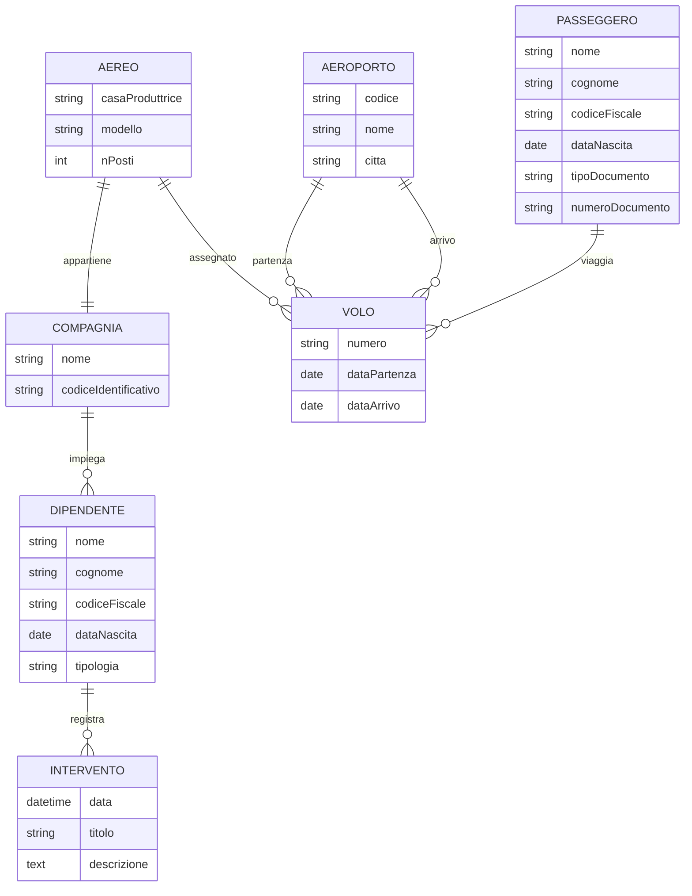

Creare lo schema ER con tutte le entità necessarie a gestire le informazioni di un aeroporto.

Ci sono molti **voli**, ciascuno dei quali è caratterizzato da un *numero*, *data* e **aeroporto di partenza**, *data* e **aeroporto di arrivo**, **aereo** e **compagnia**.
Tutti gli **aeroporti** sono rappresentati da un *codice*, oltre che dal *nome* e dalla *città*.
Per ogni **aereo** è necessario memorizzare la *casa produttrice*, *modello* e *numero di posti*. 
Le **compagnie** hanno un *nome*, un *codice identificativo* e una *lista di dipendenti*, che possono essere *piloti*, *hostess*, *steward* o *manutentori*.
Ogni volta che viene effettuato un **intervento di manutenzione** ad un aereo è necessario registrare un rapporto con *data*, *ora*, *titolo*, *descrizione*, **manutentori** e **aereo** interessato.
Tutti i **passeggeri** devono identificarsi con *nome*, *cognome*, *codice fiscale*, *data di nascita* e *documento di identità*, sia esso carta *d'identità* o *passaporto*.

##  Soluzione
![[Pasted image 20231122121949.png]]

### ChatGPT Example

